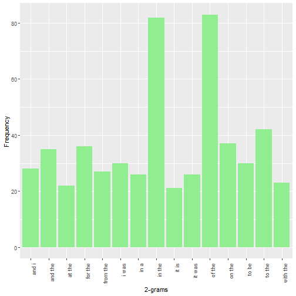
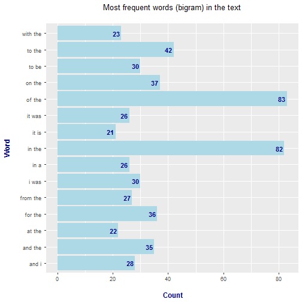
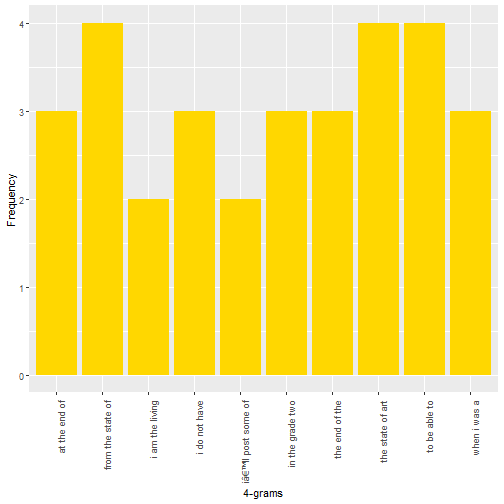

1. Understanding the problem
1. Data acquisition and cleaning
1. **Exploratory analysis**
1. **Statistical modeling**
1. Predictive modeling
1. Creative exploration
1. Creating a data product
1. Creating a short slide deck pitching your product

### loading data
Data are in [this link](https://d396qusza40orc.cloudfront.net/dsscapstone/dataset/Coursera-SwiftKey.zip)

Tasks to do [TASK Two](https://www.coursera.org/learn/data-science-project/supplement/BePVz/task-2-exploratory-data-analysis) and [TASK Three](https://www.coursera.org/learn/data-science-project/supplement/2IiM9/task-3-modeling)


```r
linesTOread<-50000
blog <- readLines("en_US/en_US.blogs.txt", linesTOread, skipNul = TRUE, warn = TRUE)
#news <- readLines("en_US/en_US.news.txt", linesTOread, skipNul = TRUE, warn = TRUE)
#twitter <- readLines("en_US/en_US.twitter.txt", linesTOread, skipNul = TRUE, warn = TRUE)
#print(twitter)
```

#### Sampling

```r
set.seed(2020)
SampleBlogs  <- sample(blog, 0.01 * length(blog) ) # take a sample
rm(blog)
```

Word Counting and searching for the most frequent word 
We will use the **_ngram_ library**


```r
if (!require("ngram")) { install.packages("ngram") }
```

```
## Loading required package: ngram
```

```r
text<-preprocess(concatenate(SampleBlogs), case="lower", remove.punct = TRUE, fix.spacing = TRUE)
head ( get.phrasetable(ng<- ngram (text , n =1)), 15)
```

```
##    ngrams freq        prop
## 1    the   981 0.049946540
## 2     to   606 0.030853826
## 3    and   547 0.027849906
## 4      a   422 0.021485668
## 5     of   418 0.021282012
## 6      i   386 0.019652767
## 7     in   303 0.015426913
## 8   that   221 0.011251973
## 9     is   201 0.010233695
## 10    it   191 0.009724556
## 11   for   177 0.009011761
## 12   was   172 0.008757192
## 13   you   152 0.007738913
## 14  with   145 0.007382516
## 15    on   144 0.007331602
```

```r
print(head (DT<- get.phrasetable(ng2<- ngram (text , n =2)), 15))
```

```
##       ngrams freq        prop
## 1    of the    83 0.004226069
## 2    in the    82 0.004175153
## 3    to the    42 0.002138493
## 4    on the    37 0.001883910
## 5   for the    36 0.001832994
## 6   and the    35 0.001782077
## 7     i was    30 0.001527495
## 8     to be    30 0.001527495
## 9     and i    28 0.001425662
## 10 from the    27 0.001374745
## 11   it was    26 0.001323829
## 12     in a    26 0.001323829
## 13 with the    23 0.001171079
## 14   at the    22 0.001120163
## 15    it is    21 0.001069246
```

```r
head ( get.phrasetable(ng3<- ngram (text , n =3)), 15)
```

```
##            ngrams freq         prop
## 1     be able to     9 0.0004582718
## 2    at the time     8 0.0004073527
## 3    some of the     7 0.0003564336
## 4       a lot of     6 0.0003055145
## 5  the fact that     5 0.0002545954
## 6   in the grade     5 0.0002545954
## 7  the grade two     5 0.0002545954
## 8       it was a     5 0.0002545954
## 9  the back yard     5 0.0002545954
## 10    one of the     5 0.0002545954
## 11  in the world     5 0.0002545954
## 12     in the us     4 0.0002036764
## 13      i do not     4 0.0002036764
## 14    the end of     4 0.0002036764
## 15    to be able     4 0.0002036764
```

```r
head ( DT4<-get.phrasetable(ng4<- ngram (text , n =4)), 15)
```

```
##                  ngrams freq         prop
## 1     the state of art     4 0.0002036867
## 2    from the state of     4 0.0002036867
## 3        to be able to     4 0.0002036867
## 4        i do not have     3 0.0001527650
## 5        at the end of     3 0.0001527650
## 6       the end of the     3 0.0001527650
## 7     in the grade two     3 0.0001527650
## 8         when i was a     3 0.0001527650
## 9      i am the living     2 0.0001018434
## 10 iâ\200\231ll post some of     2 0.0001018434
## 11   this was going to     2 0.0001018434
## 12     i told him that     2 0.0001018434
## 13      do not have to     2 0.0001018434
## 14  a light blue hanky     2 0.0001018434
## 15 knew this was going     2 0.0001018434
```

### ploting
bigram


```r
if (!require("ggplot2")) { install.packages("ggplot2") }
ggplot(DT[1:15,], aes(x=ngrams, y=freq)) + 
    geom_bar(stat="Identity", fill="lightgreen") + 
    theme(axis.text.x = element_text(angle = 90, hjust = 1)) + xlab("2-grams") + 
    ylab("Frequency")
```



other VIZ

```r
ggplot(DT[1:15,], aes(x=ngrams, y=freq)) +
  geom_col(fill="lightblue") +
  coord_flip() +
  labs(x= "Word\n", y="\n Count", title="Most frequent words (bigram) in the text\n")+
  geom_text(aes(label=freq),hjust=1.2, color="darkblue", fontface="bold") +
  theme(plot.title = element_text(hjust=0.5), axis.title.x = element_text(face="bold",color="darkblue", size=12), 
        axis.title.y = element_text(face="bold",color="darkblue", size=12))
```




4-gram

```r
if (!require("ggplot2")) { install.packages("ggplot2") }
ggplot(DT4[1:10,], aes(x=ngrams, y=freq)) + 
    geom_bar(stat="Identity", fill="gold") + 
    theme(axis.text.x = element_text(angle = 90, hjust = 1)) + xlab("4-grams") + 
    ylab("Frequency")
```



### Some other feature : Frequency sorted

How many unique words do you need in a frequency sorted dictionary to cover 50% of all word instances in the language? 90%?

```r
for (percent in c(0.5,0.9)) {
  i<-1
  numberWords<-get.phrasetable(ng)$freq[i]
  while (sum(get.phrasetable(ng)$freq)*percent>numberWords) {
    i<-i+1
    numberWords<-numberWords+get.phrasetable(ng)$freq[i]
    }
  print(paste("we have ",toString(i) , "words to cover over", toString(percent*100), "% of our Datas"))
}
```

```
## [1] "we have  111 words to cover over 50 % of our Datas"
## [1] "we have  2980 words to cover over 90 % of our Datas"
```
